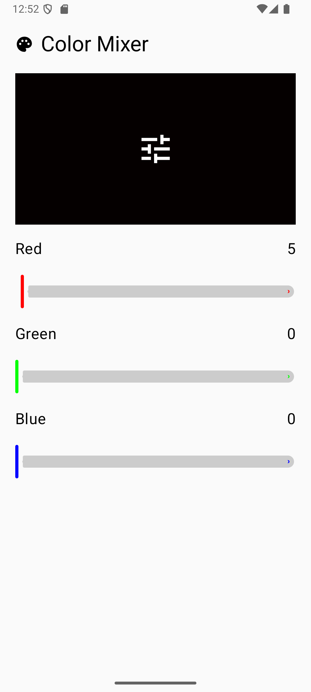
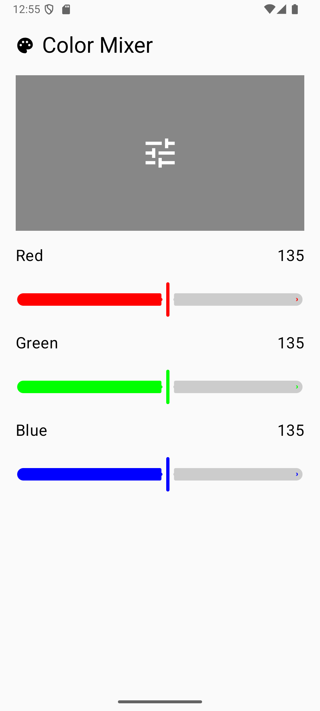

# Color Mixer App

Color Mixer is an Android application that allows users to mix colors using three sliders (for Red, Green, and Blue values). The app shows a real-time preview of the combined color as the user adjusts the sliders.

## Features

- Three sliders to control the RGB (Red, Green, Blue) color values.
- Real-time color preview based on the slider values.
- Simple and user-friendly interface.

## Requirements

- Android Studio
- Android device or emulator
- Kotlin

## Instructions to run the application locally

1. Clone this repository to your local machine:
   ```bash
   https://github.com/dani31perez/colorMixer.git
   ```

2. Open the project in **Android Studio**.

3. Make sure you have an emulator or a physical device connected.

4. Run the app from Android Studio, selecting the appropriate device or emulator.

5. You should see the interface with three sliders (Red, Green, Blue), and as you move them, the screen color will change in real-time according to the mixture of the slider values.

## Screenshots


*Main screen of the app with sliders to adjust the RGB values.*


*Real-time preview of the combined color based on the slider values.*

